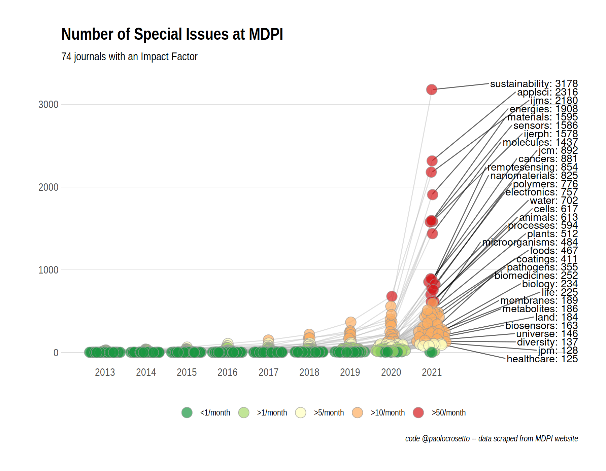

# MDPI special issues

This repository contains scripts to scrape MDPI website and get the number of special issues for all of their journals with an Impact Factor. They are 74 as of March 12th, 2021.

It also contains an R script to generate a summary plot.

## I just want the data!

The data you want is provided in two .csv files.

-   `jounrals.csv` contains basic data on 74 MDPI journals
-   `SIs.csv` contains a line for each MDPI special issue ever made, or now open and in progress, for which a deadline exists.

## I just want the plot!

You want to the `MPDI_special_issues_2013-21.png` file.

Or just look here:

## I want to reproduce the analysis!

1.  run scraping.R. It takes *about 20 minutes to run*. It generates `journals.csv`, with journals basic data, and `SIs.csv`, with the list of all 55k+ special issues of the 74 MDPI journals.

2.  (if you want to plot) run plotting.R

## I want to change the analysis / include more journals!

Feel free to clone this repo. I would appreciate if you kept me posted on what you do.

## 
